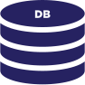
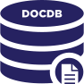
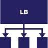
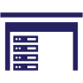
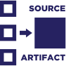
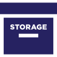
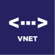

# OCI artwork and logos

This repository contains OCI artwork and logos in a variety of formats.

      &nbsp;  &nbsp;  &nbsp;    &nbsp;  &nbsp;  &nbsp; 

<table>
<tr>
        <td style="padding-top:5%;"></td>
        <td style="padding-top:5%;"></td>
        <td style="padding-top:5%;"></td>
        <td style="padding-top:5%;"></td>
        <td style="padding-top:5%;"></td>
        <td style="padding-top:5%;"></td>
        <td style="padding-top:5%;"></td>
        <td style="padding-top:5%;"></td>
 	    </tr>
 	<tr>
	<th style="width:10%">2fa</th>
        <th style="width:10%">api</th>
        <th style="width:10%">authentication</th>
        <th style="width:10%">batch</th>
        <th style="width:10%">billing</th>
        <th style="width:10%">cdn</th>
  	<th style="width:10%">cli</th>
        <th style="width:10%">cloud</th>	
    </tr>
           <tr>
	<td></td>
        <td></td>
        <td></td>
        <td></td>
        <td></td>
        <td></td>
        <td></td>
        <td></td>
   </tr>
<tr>
	<th style="width:10%">config</th>
        <th style="width:10%">configservice</th>
        <th>container</th>
        <th>container host</th>
        <th>container image</th>
        <th>customer</th>
        <th>database</th>
        <th>debugging</th>
    </tr>
        <tr>
	<td></td>
        <td></td>
 	<td></td>
        <td></td>
	<td></td>
        <td></td>
 	<td></td>
        <td></td>
    </tr>
<tr>
	<th>desktop</th>
        <th>developer</th>
	<th>devices</th>
        <th>disk</th>
	<th>distribution</th>
        <th>docdb</th>
	<th>file</th>
        <th>firewall</th>
    </tr>
        <tr>
	<td></td>
        <td></td>
 	<td></td>
        <td></td>
	<td></td>
        <td></td>
 	<td></td>
        <td></td>
    </tr>
<tr>
	<th>firewall rule</th>
        <th>function</th>
	<th>git</th>
        <th>health monitoring</th>
	<th>invoice</th>
        <th>iot</th>
	<th>key vault</th>
        <th>key</th>
    </tr>
        <tr>
	<td></td>
        <td></td>
 	<td></td>
        <td></td>
	<td></td>
        <td></td>
 	<td></td>
        <td></td>
    </tr>
<tr>
	<th>laptop</th>
        <th>legacy mainframe</th>
	<th>load balancer</th>
        <th>logging</th>
	<th>machine learning</th>
        <th>media</th>
	<th>media streaming</th>
        <th>message</th>
    </tr>
        <tr>
	<td></td>
        <td></td>
 	<td></td>
        <td></td>
	<td></td>
        <td></td>
 	<td></td>
        <td></td>
    </tr>
<tr>
	<th>mobile</th>
        <th>monitoring</th>
	<th>onprem</th>
        <th>orchestrator</th>
	<th>pipeline</th>
        <th>policy enforcement</th>
	<th>policy manager</th>
        <th>queue</th>
    </tr>
        <tr>
	<td></td>
        <td></td>
 	<td></td>
        <td></td>
	<td></td>
        <td></td>
 	<td></td>
        <td></td>
    </tr>
<tr>
	<th>sbom</th>
        <th>scheduled job</th>
	<th>sdk</th>
        <th>security scanning</th>
	<th>serverdesk</th>
        <th>serverless</th>
	<th>serverrack</th>
        <th>service</th>
    </tr>
        <tr>
	<td></td>
        <td></td>
 	<td></td>
        <td></td>
	<td></td>
        <td></td>
 	<td></td>
        <td></td>
    </tr>
<tr>
	<th>shell</th>
        <th>signature job</th>
	<th>source artifact.</th>
        <th>storage scanning</th>
	<th>support<b>personnel</th>
        <th>testing</th>
	<th>vm</th>
        <th>vnet</th>
    </tr>
</table>
